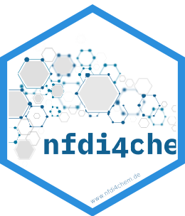
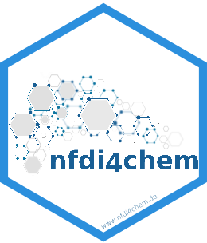

# The NFDI4Chem institute sticker

* URL: https://www.nfdi4chem.de/
* Sticker maintainer: [Steffen Neumann](https://github.com/sneumann/)
* License: Creative Commons Attribution
  [CC-BY](https://creativecommons.org/licenses/by/4.0/). Feel free to
  share and adapt, but don't forget to credit the author.

In case you need different versions, check out the `Makefile` how to convert.
